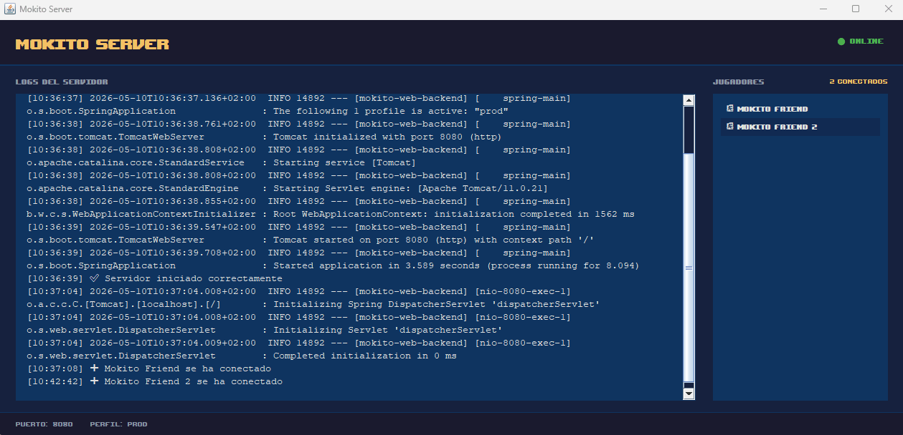

# Mokito Web Backend


Backend en Spring Boot para un entorno colaborativo en tiempo real donde múltiples usuarios comparten un canvas con sus cursores y mascotas virtuales sincronizadas vía WebSocket.



---

## Características

- Sincronización de cursores en tiempo real entre todos los usuarios conectados
- Mascotas virtuales por usuario con posición persistente en sesión
- Registro simultáneo usuario + mascota mediante mensaje `init_full`
- Snapshot de estado completo al conectarse: nuevos usuarios reciben el estado de todos los que ya estaban
- Broadcast automático de entradas, salidas y actualizaciones decursores/mascotas
- Limpieza automática de sesiones al desconectarse
- Escalado de coordenadas adaptado a distintas resoluciones de canvas
- Enrutamiento flexible de eventos WebSocket (init, init_full, user_data, init_pet, move_pet)

---

## Tecnologías

| Capa | Tecnología |
|---|---|
| Lenguaje | Java 17 |
| Framework | Spring Boot 4.0.5 |
| Comunicación | Spring WebSocket |
| Build | Maven 3.6+ |
| Utilidades | Lombok |

---

## Instalación

### Requisitos

- Java 17+
- Maven 3.6+

### Ejecutar en local

```bash
mvn clean compile
mvn spring-boot:run
```

El servidor WebSocket quedará disponible en `ws://localhost:8080/`.

### Build de producción

```bash
mvn clean package
java -jar target/mokito-web-backend-0.0.1-SNAPSHOT.jar
```

### Docker

```bash
mvn spring-boot:build-image
```

---

## 📁 Estructura del Proyecto (Mejorar y descripciones)

```
src/main/java/com/mokito/backend/
├── MokitoWebBackendApplication.java  # Punto de entrada Spring Boot

├── config/
│   ├── CorsConfig.java               # Configura CORS para permitir orígenes cruzados
│   └── WebSocketConfig.java          # Registra el endpoint WebSocket y configura STOMP

├── controller/
│   ├── LoginController.java          # POST /login — genera y devuelve userId único
│   └── UsersController.java          # GET /user/all — lista usuarios conectados; GET /user/ping — latencia

├── handler/
│   ├── UserDataHandler.java          # Maneja init, user_data: registra/actualiza usuarios y notifica broadcast
│   └── PetDataHandler.java           # Maneja init_pet, move_pet: registra/actualiza mascotas y broadcast

├── model/
│   ├── dto/
│   │   └── UserDto.java              # DTO para transferencia de datos de usuario
│   └── entity/
│       ├── UserClient.java           # Entidad usuario (id, nombre, cursor, canvas)
│       ├── PetClient.java            # Entidad mascota (x, y, userId)
│       ├── CursorClient.java         # Entidad cursor (x, y, src imagen)
│       ├── CanvasClient.java         # Entidad canvas (ancho, alto)
│       └── AnimationSpriteClient.java# Sprite animado del usuario

├── router/
│   └── EventRouter.java              # Enruta mensajes WebSocket entrantes: init_full, init, user_data, init_pet, move_pet

├── service/
│   ├── WebSocketSessionManager.java  # Gestiona sesiones y usuarios en maps thread-safe (ConcurrentHashMap)
│   └── PetServices.java              # Lógica de negocio para mascotas (crear, actualizar, eliminar)

└── websocket/
    ├── WebSocketHandler.java         # Handler principal: recibe mensajes, los enruta y limpieza al desconectar
    └── WebSocketDispatcher.java      # Envía mensajes a todos (broadcast) o a uno (unicast) con manejo de errores
```

---

### Flujo de conexión

```
Cliente                          Servidor
  │                                 │
  ├──POST /login ──────────────────►│  Obtiene userId
  │◄── { userId } ──────────────────┤
  │                                 │
  ├──WS connect ───────────────────►│
  │                                 │
  ├──{ type: "init_full",           │  Registra usuario Y mascota
  │     user: { ... },              │  (ambos en un solo mensaje)
  │     pet: { x, y } } ────────────►│
  │                                 │
  │◄── user_data [para cada         │  Snapshot: cursor + canvas
  │    usuario existente] ──────────┤  de todos los usuarios
  │◄── init_pet [para cada          │  Snapshot: posición de
  │    mascota existente] ──────────┤  cada mascota existente
  │                                 │
  ├──{ type: "user_data",           │  Actualiza cursor (broadcast)
  │     payload: { user: {...} } } ─►│
  │                                 │
  ├──{ type: "move_pet",            │  Actualiza mascota (broadcast)
  │     payload: { pet_move: {...} } } ─►│
```

### Inicialización alternativa (solo usuario)

Si el cliente solo envía `init` (sin `pet`), el servidor registra únicamente el usuario y envía el snapshot sin mascota:

```
Cliente                          Servidor
  │                                 │
  ├──{ type: "init",               │  Registra usuario
  │     user: { ... } } ────────────►│  (sin mascota)
  │                                 │
  │◄── user_data [cada usuario] ────┤  Snapshot de cursores
  │                                 │  (sin pets)
```

### Desconexión

Al cerrarse la conexión WebSocket, el servidor notifica a todos los clientes:

```
Cliente                          Servidor
  │                                 │
  │    [conexión cerrada]           │
  │                                 │◄── { type: "user_remove",
  │                                    userId: "..." }
```

---

### Tipos de mensaje soportados

#### Mensajes del cliente → servidor

**`init` — Registrar usuario al conectarse** *(sin mascota)*

```json
{
  "type": "init",
  "user": {
    "userId": "user123",
    "name": "Mokito Friend",
    "cursor": { "x": 100, "y": 200, "src": "cursor.png" },
    "canvas": { "width": 1920, "height": 1080 }
  }
}
```

**`init_full` — Registrar usuario y mascota simultáneamente** *(recomendado)*

```json
{
  "type": "init_full",
  "user": {
    "userId": "user123",
    "name": "Mokito Friend",
    "cursor": { "x": 100, "y": 200, "src": "cursor.png" },
    "canvas": { "width": 1920, "height": 1080 }
  },
  "pet": { "x": 150, "y": 250 }
}
```

**`user_data` — Actualizar cursor del usuario** *(enviado cada network tick)*

```json
{
  "type": "user_data",
  "payload": {
    "user": {
      "cursor": { "x": 320, "y": 480, "src": "cursor.png" },
      "canvas": { "width": 1920, "height": 1080 }
    }
  }
}
```

**`init_pet` — Registrar mascota** *(solo si no se usó `init_full`)*

```json
{
  "type": "init_pet",
  "pet": { "x": 150, "y": 250 }
}
```

**`move_pet` — Actualizar posición de la mascota** *(enviado cada network tick si se movió)*

```json
{
  "type": "move_pet",
  "payload": {
    "pet_move": { "x": 200, "y": 300, "userId": "user123" }
  }
}
```

---

#### Mensajes del servidor → cliente (broadcast)

**`user_data` — Estado actualizado de un usuario**

```json
{
  "type": "user_data",
  "user": {
    "userId": "user123",
    "name": "Mokito Friend",
    "cursor": { "x": 320, "y": 480, "src": "cursor.png" },
    "canvas": { "width": 1920, "height": 1080 }
  }
}
```

**`init_pet` — Mascota registrada (todos los usuarios la reciben)**

```json
{
  "type": "init_pet",
  "pet": { "x": 150, "y": 250, "userId": "user123" }
}
```

**`pet_move` — Mascota moviéndose**

```json
{
  "type": "pet_move",
  "pet_move": { "x": 200, "y": 300, "userId": "user123" }
}
```

**`user_remove` — Usuario desconectado**

```json
{
  "type": "user_remove",
  "userId": "user123"
}
```

---

## Endpoints REST

### Usuarios y Sesiones

| Método | Ruta | Descripción |
|---|---|---|
| `POST` | `/login` | Crea sesión y devuelve `userId` |
| `GET` | `/user/all` | Lista todos los usuarios conectados |
| `GET` | `/user/ping` | Medición de latencia |

### Mascotas y Animaciones

| Método | Ruta | Descripción |
|---|---|---|
| `POST` | `/pet/{userId}/sprites` | Sube animaciones de mascota (multipart: files + metadata) |
| `GET` | `/pet/{userId}/sprites` | Lista todas las animaciones de un usuario |
| `GET` | `/pet/{userId}/sprites/{animationName}/image` | Obtiene la imagen de una animación específica |
| `GET` | `/pet/sprites/all` | Obtiene todos los sprites de todos los usuarios |

---

## 📦 Gestión de Animaciones de Mascotas

### Flujo de subida de animaciones

El sistema permite a cada usuario subir múltiples sprites de animación para su mascota. Cada animación se compone de:

- **Nombre único** (ej: `walk`, `idle`, `run`)
- **Frame width/height** — dimensiones de cada frame en la sprite sheet
- **Frame count** — número total de frames en lasheet
- **Animation type** — tipo de animación (ej: `loop`, `once`)
- **Imagen binaria** (PNG) — sprite sheet conteniendo todos los frames

#### Ejemplo de request (multipart/form-data)

```
POST /pet/{userId}/sprites
Content-Type: multipart/form-data

--boundary
Content-Disposition: form-data; name="files"; filename="walk.png"
Content-Type: image/png

<bytes de la imagen>
--boundary
Content-Disposition: form-data; name="metadata"
Content-Type: application/json

{
  "name": "walk",
  "frameWidth": 32,
  "frameHeight": 32,
  "frameCount": 8,
  "animationType": "loop"
}
--boundary--
```

> **Nota:** La lista `files` y `metadata` debe tener el mismo número de elementos, emparejados por índice.

#### Respuesta

```http
HTTP/1.1 200 OK
```

### Obtención de animaciones

**Listar animaciones de un usuario:**

```http
GET /pet/{userId}/sprites
```

Respuesta:

```json
[
  {
    "name": "walk",
    "src": "/pet/user123/sprites/walk/image",
    "frameWidth": 32,
    "frameHeight": 32,
    "frameCount": 8,
    "animationType": "loop"
  },
  {
    "name": "idle",
    "src": "/pet/user123/sprites/idle/image",
    "frameWidth": 32,
    "frameHeight": 32,
    "frameCount": 4,
    "animationType": "loop"
  }
]
```

**Obtener imagen específica:**

```http
GET /pet/{userId}/sprites/{animationName}/image
```

Devuelve la imagen binaria en `image/png`.

### Uso en tiempo real

Una vez subidas las animaciones, el cliente puede enviar el nombre de la animación actual en los mensajes `move_pet`:

```json
{
  "type": "move_pet",
  "payload": {
    "pet_move": {
      "x": 200,
      "y": 300,
      "userId": "user123",
      "currentAnimation": "walk"
    }
  }
}
```

El servidor broadcastea la actualización a todos los usuarios conectados:

```json
{
  "type": "pet_move",
  "pet_move": {
    "x": 200,
    "y": 300,
    "userId": "user123",
    "currentAnimation": "walk"
  }
}
```

---

## Tests

```bash
mvn test
```


Tutorial epico de conexion y uso del cloudfare tunel

> [!WARNING]
> Este proyecto está bajo una licencia personalizada que prohíbe el uso para entrenamiento de inteligencia artificial. Consulta el archivo [LICENSE](LICENSE) para más detalles.
